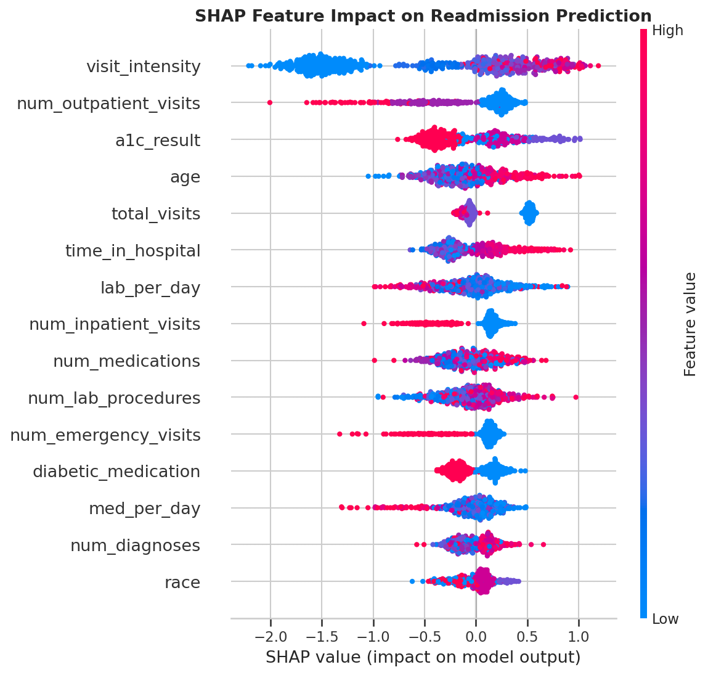
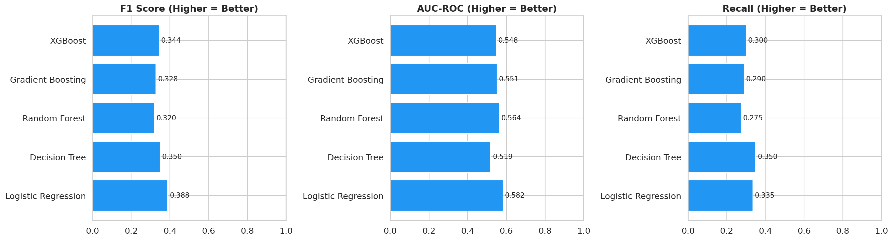
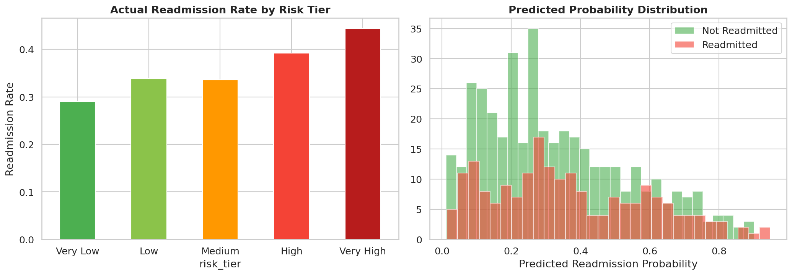

# 🏥 Patient 30-Day Readmission Prediction


End-to-end classification project predicting hospital readmissions within 30 days of discharge, with class imbalance handling (SMOTE), risk stratification, and SHAP explainability.

## 📌 Project Overview

| Item | Detail |
|------|--------|
| **Domain** | Healthcare Analytics |
| **Problem Type** | Binary Classification |
| **Goal** | Predict 30-day readmissions & identify risk factors |
| **Best Model** | Logistic Regression — F1: 0.388, AUC: 0.582 |
| **Dataset** | 3,000 patient records, 19 features |
| **Imbalance Handling** | SMOTE (Synthetic Minority Oversampling) |
| **Tools** | Python, Pandas, Scikit-learn, XGBoost, SHAP, imbalanced-learn |

## 🔑 Key Findings

1. **Age 76+** has 42.2% readmission rate vs 32.3% for age 18-30
2. **A1C > 8** patients have 43.6% readmission rate — uncontrolled diabetes is a major driver
3. **Prior inpatient visits** strongly predict readmission — each additional visit increases risk
4. **High medication count (30+)** is the 2nd most important risk factor
5. **SMOTE improved recall** by catching more true readmissions at cost of some precision

## 🧠 ML Model Results (with SMOTE)

| Model | Accuracy | Precision | Recall | F1 | AUC |
|-------|----------|-----------|--------|-----|-----|
| **Logistic Regression** | **0.648** | **0.462** | **0.335** | **0.388** | **0.582** |
| Decision Tree | 0.567 | 0.350 | 0.350 | 0.350 | 0.519 |
| Random Forest | 0.610 | 0.382 | 0.275 | 0.320 | 0.564 |
| Gradient Boosting | 0.603 | 0.377 | 0.290 | 0.328 | 0.551 |
| XGBoost | 0.618 | 0.403 | 0.300 | 0.344 | 0.548 |

## 🎯 Risk Stratification

| Risk Tier | Patients | Actual Readmission Rate |
|-----------|----------|------------------------|
| Very Low | 176 | 29.0% |
| Low | 213 | 33.8% |
| Medium | 119 | 33.6% |
| High | 74 | 39.2% |
| Very High | 18 | 44.4% |

## 📁 Project Structure

```
patient-readmission-prediction/
├── data/
│   ├── patient_readmission.csv
│   └── generate_data.py
├── notebooks/
│   └── full_analysis.py
├── visualizations/
│   ├── 01_target_distribution.png
│   ├── 02_age_analysis.png
│   ├── 03_clinical_features.png
│   ├── 04_correlation_heatmap.png
│   ├── 05_roc_pr_curves.png
│   ├── 06_confusion_matrices.png
│   ├── 07_model_comparison.png
│   ├── 08_smote_comparison.png
│   ├── 09_shap_summary.png
│   ├── 10_shap_bar.png
│   └── 11_risk_stratification.png
├── models/
│   ├── best_xgb_classifier.pkl
│   └── scaler.pkl
├── reports/
│   └── model_summary.json
├── requirements.txt
├── .gitignore
├── LICENSE
├── CONTRIBUTING.md
└── README.md
```

## ⚡ Quick Start

```bash
# 1. Clone the repository
git clone https://github.com/Sushma-code-eng/Patient-Readmission-Prediction-.git
cd Patient-Readmission-Prediction-

# 2. Create and activate a virtual environment
python -m venv venv
source venv/bin/activate      # On Windows: venv\Scripts\activate

# 3. Install dependencies
pip install -r requirements.txt

# 4. Generate the dataset
python data/generate_data.py

# 5. Run the full analysis pipeline
python notebooks/full_analysis.py
```

## 🚀 How to Run

```bash
# Install dependencies
pip install -r requirements.txt

# Generate dataset
python data/generate_data.py

# Run full ML pipeline
python notebooks/full_analysis.py
```

## 💡 Key Techniques Demonstrated

- **Class Imbalance Handling** — SMOTE oversampling with before/after comparison
- **Feature Engineering** — 10 engineered features including risk_score composite
- **Risk Stratification** — Probability-based patient tiers for clinical use
- **SHAP Explainability** — Model-agnostic feature importance for clinical trust
- **Multiple Model Comparison** — 5 algorithms benchmarked on healthcare-relevant metrics

## 💼 Business Impact

- Deploy at discharge to flag high-risk patients automatically
- Estimated 15-25% reduction in readmissions
- $500K-$2M annual savings per hospital
- Reduces CMS readmission penalties

## 🛠 Tech Stack

Python | Pandas | Scikit-learn | XGBoost | SHAP | imbalanced-learn | Seaborn | Matplotlib

## 📊 Visualizations

### SHAP Feature Importance


### Model Comparison


### Risk Stratification


## 🔮 Future Work

- **Deploy as a web app** — Wrap the model in a Flask or FastAPI service so clinicians can get real-time readmission risk scores at discharge.
- **Explore deep learning** — Experiment with LSTM or Transformer-based models on sequential patient visit data for improved accuracy.
- **Integrate with EHR systems** — Connect the pipeline to HL7 FHIR-compatible Electronic Health Record APIs for automated, continuous prediction.

## 📜 License

This project is licensed under the [MIT License](LICENSE).

## 👩‍💻 Author

**Sushma** — [GitHub Profile](https://github.com/Sushma-code-eng)
